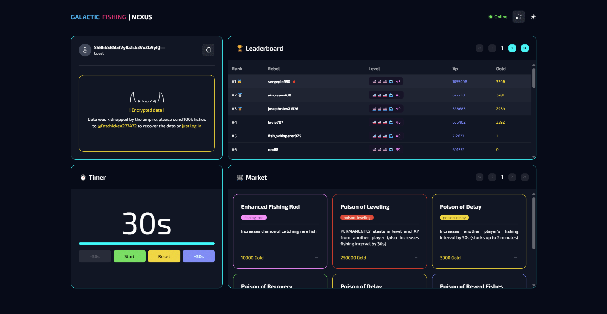

# 🛸 Galactic Fishing | Nexus

Galactic Fishing | Nexus is the central hub for the Rebel forces. From here, you can:

- Track real-time leaderboard & Market
- Monitor metrics
- Essential tools to support your rebellion and interstellar fishing adventure

## ✨ Features

- Light/dark mode toggle
- Live previews
- PWA support

## 💻 Run Locally

Clone the project

```bash
  git clone https://github.com/FatChicken277/galactic-fishing-front
```

Go to the project directory

```bash
  cd galactic-fishing-front
```

Install dependencies

```bash
  npm install
```

Start the server

```bash
  npm run dev
```

## 🛠️ Build

To deploy this project run

```bash
  npm run build
```

Run the build preview (Necessary to debug PWA)

```bash
  npm run preview
```

## ⚙️ Tech & Optimization Overview

This project uses a carefully selected stack for performance, simplicity, and efficiency:

- **Tailwind CSS** for fast and utility-first styling, with built-in purge support to remove unused styles.
- **cssnano** + **autoprefixer** via PostCSS for minified and cross-browser-compatible CSS.
- **Preact** for a lightweight alternative to React, reducing bundle size without sacrificing functionality.
- **TypeScript** to catch errors early and improve code quality.
- **DaisyUI** + **Headless UI** for accessible, customizable components without relying on heavy UI kits.

### 📦 Estimated Optimization Impact

| Optimization                            | Purpose                          | Estimated Gain     |
| --------------------------------------- | -------------------------------- | ------------------ |
| **Preact instead of React**             | Smaller UI library               | ~30–40KB gzipped   |
| **Tailwind with PurgeCSS (built-in)**   | Remove unused styles             | ~3MB → ~5–30KB CSS |
| **PostCSS: cssnano + autoprefixer**     | Minify CSS & add vendor prefixes | ~5–20% smaller CSS |
| **DaisyUI & Headless UI (modular use)** | Avoid heavy component libraries  | ~10–50KB saved     |
| **TypeScript**                          | Reduce runtime bugs              | Dev-time safety    |

### 📊 Build Size Reduction

| Asset                    | **Optimized (This Project)**    | **Unoptimized (Est.)**          | **Reduction** |
| ------------------------ | ------------------------------- | ------------------------------- | ------------- |
| **CSS Bundle**           | 63.47 KB → **11.87 KB** (gzip)  | ~250–300 KB (gzip)              | ~88% smaller  |
| **JS Bundle**            | 132.23 KB → **42.82 KB** (gzip) | ~300–500 KB (gzip, React + MUI) | ~70% smaller  |
| **HTML**                 | 3.04 KB → **1.05 KB** (gzip)    | Similar                         | ~65% smaller  |
| **Service Worker + PWA** | ✅ Included (194 KB precache)   | ❌ Missing/Heavier              | N/A           |

> 📦 **Total gzip size**: **~55 KB** (optimized) vs. **~600–800 KB** (unoptimized)

## 📸 Screenshots



## ✍️ Authors

- [@FatChicken277](https://www.github.com/FatChicken277)
